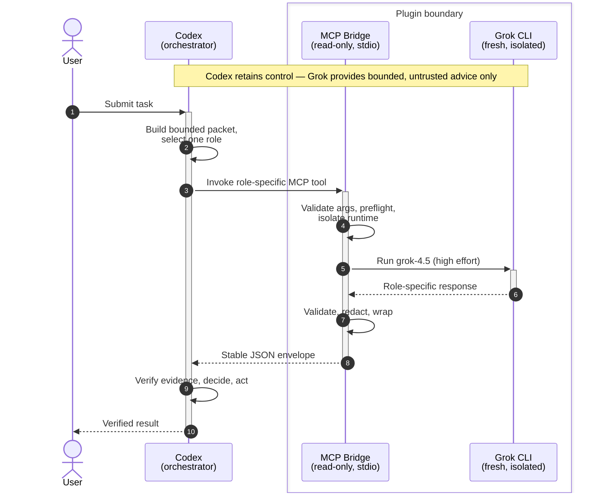

# Grok Advisor for Codex

[](CHANGELOG.md)
[](https://x.ai/)
[](https://www.python.org/)
[](LICENSE)

Use Grok 4.5 as a bounded, read-only advisor inside Codex. Codex remains the
root orchestrator: it frames the handoff, decides what feedback to accept,
implements authorized changes, runs verification, and answers the user.

Version 0.2 adds structured plan gates, schema-validated research and workspace
findings, an opt-in independent review panel, truthful route states, and a more
isolated Grok runtime. The plugin remains Grok-only and does not add an executor,
another model CLI, global routing changes, custom Codex providers, or persistent
Grok configuration.

## What it is good for

- Challenge a complex plan before implementation.
- Require a fail-closed `PLAN_APPROVED` or `PLAN_REVISE` decision.
- Run current web research with claims tied to direct source URLs.
- Inspect a repository without giving Grok edit or shell tools.
- Compare two or three fresh, independent reviews for a high-stakes decision.
- Double-check a material conclusion while keeping one orchestrator in charge.

Grok output is always untrusted advice. Codex must verify important claims
against repository evidence, primary sources, or direct tests.

## Architecture



> `grok_status` stops after preflight with no model call. Panel mode may run
> two or three independent Grok processes in parallel.

Codex is the sole root orchestrator. The Grok Advisor skill is Codex-side policy
for choosing one bounded role; it is not a separate agent. Codex sends a
self-contained packet to the read-only MCP bridge, which handles argument
validation, preflight checks, runtime isolation, output validation, redaction,
cleanup, and the stable envelope. Codex independently verifies the result before
acting or responding.

Every model-backed call uses a fresh stateless Grok process pinned to `grok-4.5`
and high effort. Responses are role-specific: `consult_grok` returns prose,
while plan, research, workspace, and panel modes return structured results. Codex
alone compares and synthesizes independent panel reviews.

## Tools

| Tool | Use | Grok access | Output |
| --- | --- | --- | --- |
| `consult_grok(packet)` | Second opinion, tradeoffs, answer check | No tools | Prose |
| `review_plan_with_grok(packet)` | Fail-closed implementation-plan gate | No tools | Decision, findings, corrections, verification |
| `research_with_grok(packet)` | Current or niche external research | `web_search`, `web_fetch` | Claims, sources, uncertainties, inferences |
| `review_workspace_with_grok(packet, cwd)` | Code, architecture, security, or test review | `read_file`, `grep`, `list_dir` | Severity-ranked findings and recommended tests |
| `review_with_grok_panel(packet, panel_size=2)` | High-stakes independent review | No tools; 2–3 fresh calls | Ordered member reviews for Codex synthesis |
| `grok_status()` | Compatibility, login, model, profile, and isolation diagnostics | No model call | Readiness and truthful route state |

Single-pass consultation is the default. The panel is opt-in and is capped at
three calls.

## Requirements

- Codex with plugin marketplace support
- Python 3.10 or newer; no third-party Python packages
- Grok CLI 0.2.99 or newer
- A local grok.com login that advertises the exact `grok-4.5` model

The bridge resolves the Grok executable in this order:

1. `GROK_CLI_PATH`
2. `PATH`
3. `~/.local/bin/grok`
4. `~/.grok/bin/grok`
5. `/opt/homebrew/bin/grok`
6. `/usr/local/bin/grok`

Check the CLI before installation:

```sh
grok --version
grok models
```

Authenticate outside Codex if needed:

```sh
grok login
```

## Installation

Add this repository as a Codex marketplace and install the plugin:

```sh
codex plugin marketplace add keiranhaax/grok-plugin
codex plugin add grok-orchestrator@grok-plugin
```

Start a new Codex task after installation. Plugin skills and MCP tools are
discovered when a task starts, so an already-open task may not expose them.

Confirm the installed snapshot:

```sh
codex plugin list --json
```

## Usage

You normally invoke the plugin in natural language. Mention Grok explicitly
when participation is required.

### Check readiness without spending a model call

```text
Use Grok Advisor to check the Grok 4.5 route. Do not make a model call.
```

`grok_status()` checks:

- executable path and strict CLI version parsing;
- required flags, including a separate hidden `--no-auto-update` probe;
- grok.com authentication state;
- exact `grok-4.5` availability;
- bundled profile hashes, paths, and permissions;
- API-key-auth disabling, runtime-confined configuration, and integration isolation.

The response includes `minimum_cli_version` and an ordered `readiness_issues`
array. An empty array means every no-model readiness gate passed. If setup fails
before later gates can be checked, the array reports only the diagnostic that was
actually observed.

It never returns account identity, tokens, configuration contents, or session
IDs.

### Gate a plan

```text
Use the structured Grok plan gate on this migration plan. Return
PLAN_APPROVED only if there are no material correctness, rollback, safety,
sequencing, or verification gaps. Codex must resolve every PLAN_REVISE finding.

<complete plan, constraints, and evidence>
```

The result has this shape:

```json
{
  "decision": "PLAN_REVISE",
  "summary": "A material rollback gap remains.",
  "findings": [
    {
      "priority": "high",
      "title": "Rollback trigger is undefined",
      "problem": "The plan does not say when to abort.",
      "correction": "Define a measurable threshold and recovery action."
    }
  ],
  "verification_steps": [
    "Exercise rollback in a disposable environment."
  ]
}
```

The bridge rejects unknown decisions, contradictory approvals, revisions with
no findings, missing verification, and incorrectly prioritized findings.

### Get a tool-free second opinion

```text
Ask Grok 4.5 for one independent second opinion on these architecture options.
Identify the deciding tradeoffs and what Codex should verify. Do not use tools.

<options, constraints, and known evidence>
```

### Research with sources

```text
Research this with Grok 4.5. Prefer primary sources. Return claims tied to
direct source URLs, plus uncertainties and clearly separated inferences.

Question: <complete research question>
```

The bridge enforces `http` or `https` links without embedded credentials,
requires every claim URL to appear in the source catalog, and rejects duplicate
or malformed sources. Codex must still open and verify material links.

### Review a workspace

```text
Have Grok review /absolute/path/to/project for correctness regressions,
security issues, data-integrity risks, and missing tests. Require evidenced,
severity-ranked findings with relative file paths and line numbers. Do not edit.
```

The workspace must already exist and is canonicalized before launch. Finding
paths must remain inside that directory. If the project activates a Grok
configuration layer, hook, plugin, or MCP server that the bridge cannot
isolate, the call fails closed.

File contents inspected by Grok are sent to the Grok service for inference.
Scope proprietary or sensitive repositories deliberately.

### Run an explicit panel

```text
Run a three-member Grok panel on this high-stakes decision. Keep each review
independent, then have Codex compare the findings, verify disputed claims, and
return one resolved recommendation.

<decision packet and evidence>
```

Panel members use separate lenses:

1. risk and failure modes;
2. alternatives and counterarguments;
3. evidence and verification.

If any member fails, the bridge returns `panel_incomplete`; it never labels a
partial set of reviews as consensus.

## Workflow recipes

### Plan gate

```text
Codex plan
  → Grok structured challenge
  → Codex accepts or rejects each material point
  → Codex implements and verifies
```

### Evidence-heavy research

```text
Grok structured research
  → Codex opens and verifies primary sources
  → optional single Grok final critique
  → Codex resolves conflicts and synthesizes
```

### Workspace review

```text
Grok read-only findings
  → Codex reproduces findings
  → Codex makes authorized fixes and runs tests
  → optional Grok confirmation
```

### High-stakes panel

```text
Two or three independent Grok reviews
  → Codex compares evidence and disagreement
  → Codex makes the final decision
```

## Writing a useful packet

Each call is stateless. Include:

1. The exact question or decision.
2. Relevant facts, code excerpts, links, or the artifact being reviewed.
3. Constraints and non-goals.
4. The current proposal or conclusion.
5. Known uncertainty and what would change the decision.
6. The requested focus and output.

Do not include credentials, private keys, tokens, `.env` contents, or unrelated
personal data.

## Response envelope

Every successful model call preserves a string `text` field. Structured modes
also return parsed `data`:

```json
{
  "ok": true,
  "mode": "plan_review",
  "text": "{\"decision\":\"PLAN_APPROVED\",\"findings\":[],\"summary\":\"The plan is bounded and verifiable.\",\"verification_steps\":[\"Run the release checks before push.\"]}",
  "data": {
    "decision": "PLAN_APPROVED",
    "summary": "The plan is bounded and verifiable.",
    "findings": [],
    "verification_steps": [
      "Run the release checks before push."
    ]
  },
  "requested_model": "grok-4.5",
  "effort": "high",
  "stop_reason": "EndTurn",
  "route_state": "route_accepted",
  "runtime_model_confirmed": false,
  "runtime_effort_confirmed": false
}
```

Errors use a stable, redacted shape:

```json
{
  "ok": false,
  "mode": "plan_review",
  "text": null,
  "error": {
    "code": "invalid_structured_output",
    "message": "PLAN_REVISE requires at least one finding."
  },
  "details": {
    "failure_stage": "contract_validation",
    "automatic_retry_performed": false,
    "manual_retry_allowed": true
  },
  "requested_model": "grok-4.5",
  "effort": "high"
}
```

The bridge never returns Grok thoughts, credential data, or session IDs.

## Truthful route states

| State | Meaning |
| --- | --- |
| `ready_unverified` | All no-model checks passed, but no request has confirmed the runtime route |
| `route_accepted` | A fresh response completed and validated, but the CLI did not emit both runtime model and effort metadata |
| `used_and_confirmed` | Response metadata explicitly matched `grok-4.5` and high effort |
| `unavailable` | Binary, capability, profile, authentication, model, or isolation checks failed |

Requested flags alone never produce `used_and_confirmed`. The last successful
state exists only in MCP process memory and is not persisted.

## Security boundaries

Every model process uses:

- exact `grok-4.5` and `high` effort flags;
- `strict` OS sandbox and `dontAsk` permission mode;
- `--no-memory`, `--no-subagents`, `--no-plan`, and no session resume;
- role-specific `--max-turns`, tool allowlists, comprehensive built-in
  denylists, and permission deny rules;
- one bounded inline self-check for plan, workspace, and panel reviews;
- no `--yolo`, bypass-permission mode, editing, command execution, or
  automatic update;
- a mode-`0600` prompt file whose path—not content—appears in process
  arguments;
- 2 MiB stdout and 256 KiB stderr ceilings;
- a 600-second process deadline with full process-group termination;
- cooperative SIGTERM/SIGINT cancellation that removes active Grok children,
  prompt files, and temporary credential/runtime data;
- a 900-second Codex MCP tool timeout.

The bridge constructs a minimal child environment. It removes xAI/Grok API
keys, custom model-list and inference endpoints, WebSocket routes, external
auth commands, and fetch proxies. It disables API-key authentication, memory,
subagents, write tools, MCP discovery, LSP tools, and Cursor/Claude compatibility
scanners for the child.

To avoid loading personal Grok plugins, hooks, MCPs, skills, or model overrides,
each process receives a fresh temporary `HOME` and `GROK_HOME`. The bridge
copies only the existing `auth.json` login into that private runtime with mode
`0600`; it never returns or modifies the source credential, and the temporary
copy, logs, cache, and sessions are deleted after the call.
The preflight also requires every inspected configuration layer to live inside
the fresh temporary Grok home, preventing a local model/provider mapping from
silently replacing the isolated grok.com route.

The xAI `strict` sandbox is not itself a promise of filesystem read-only
behavior. Read-only behavior comes from layered tool removal, permission denies,
feature disabling, integration isolation, and fail-closed workspace inspection.
Grok CLI 0.2.99 rejects `--check` when combined with the stronger explicit
`--no-subagents` control, so v0.2 keeps `--no-subagents` and supplies the
self-check in the bounded role instructions. `grok_status()` reports this
compatibility state rather than hiding it.
See xAI's [CLI reference](https://docs.x.ai/build/cli/reference),
[settings reference](https://docs.x.ai/build/settings/reference), and
[enterprise security guidance](https://docs.x.ai/build/enterprise).

## Environment variables

| Variable | Purpose |
| --- | --- |
| `GROK_CLI_PATH` | Explicit Grok executable; takes priority over `PATH` |
| `GROK_HOME` | Source location for the existing local grok.com login; defaults to `~/.grok` |

Provider credentials and route overrides from the Codex environment are not
forwarded to Grok.

## Updating

Refresh the Git marketplace, reinstall the snapshot, and start a new task:

```sh
codex plugin marketplace upgrade grok-plugin
codex plugin add grok-orchestrator@grok-plugin
```

See [CHANGELOG.md](CHANGELOG.md) for release details.

## Troubleshooting

### Grok CLI not found

```sh
command -v grok
grok --version
```

Set `GROK_CLI_PATH` before starting Codex when Grok is in a nonstandard
location.

### Grok CLI version unsupported

Run `grok_status()` and compare `cli_version` with `minimum_cli_version`. If
`GROK_CLI_PATH` points at an older binary, update or unset it before starting a
new Codex task. Normal resolution checks `PATH` before `~/.grok/bin/grok`.

Do not delete an older downloaded binary merely because it still exists. Fix the
active symlink, `PATH`, or `GROK_CLI_PATH`; restart Codex only when its environment
still pins the old executable.

### Login or model unavailable

```sh
grok login
grok models
```

The model list must contain the exact `grok-4.5` ID.

Use `readiness_issues` to distinguish `authentication_unavailable` from
`model_unavailable`. Run `grok login` only for the authentication case; the
plugin intentionally uses the grok.com login and disables API-key authentication
inside the isolated route.

### Structured output rejected

`invalid_structured_output` reports `failure_stage` as `json_decode` or
`contract_validation`. The bridge does not repair the response or retry
automatically. If Grok participation is required, narrow or clarify the packet
and make at most one deliberate manual retry; otherwise disclose that the
cross-check was unavailable and continue from independently verified evidence.

### Status is ready but a call fails

`ready_unverified` proves only that preflight checks passed. A live model request
can still fail because of service, network, allowance, or response-contract
errors. Omnisearch and other MCP servers are separate routes and do not affect
this plugin's readiness result.

### Route isolation failed

Run `grok_status()`. For workspace reviews, remove or disable project-scoped
Grok hooks, plugins, and MCP servers before retrying. The plugin deliberately
does not rewrite Grok configuration.

### Tools do not appear

1. Confirm the plugin with `codex plugin list --json`.
2. Start a new Codex task.
3. Ask Codex to run `grok_status()`.

### Call timed out

Narrow the packet or workspace scope and retry. A failed proactive cross-check
is not approval; Codex should disclose the failure and continue only when the
call was optional.

## Uninstalling

```sh
codex plugin remove grok-orchestrator@grok-plugin
codex plugin marketplace remove grok-plugin
```

Uninstalling does not modify Grok configuration or credentials.

## Repository layout

```text
.agents/plugins/marketplace.json             Codex marketplace catalog
CHANGELOG.md                                 Release history
plugins/grok-orchestrator/
├── .codex-plugin/plugin.json                Plugin metadata
├── .mcp.json                                MCP launch configuration
├── scripts/grok_mcp.py                      Dependency-free stdio bridge
├── scripts/agent_profiles/                  Five pinned Grok role profiles
├── skills/grok-orchestrator/SKILL.md         Codex advisor delegation policy
└── tests/test_grok_mcp.py                   Fake-CLI unit and protocol tests
tests/test_release.py                        Package and release contract tests
```

## Development

Run all tests:

```sh
python3 -m unittest discover -s plugins/grok-orchestrator/tests -v
python3 -m unittest discover -s tests -v
```

Validate the skill and plugin:

```sh
python3 ~/.codex/skills/.system/skill-creator/scripts/quick_validate.py \
  plugins/grok-orchestrator/skills/grok-orchestrator

python3 ~/.codex/skills/.system/plugin-creator/scripts/validate_plugin.py \
  plugins/grok-orchestrator

python3 scripts/release_smoke.py
```

The fake CLI suite covers model/effort pinning, role allowlists, schemas,
semantic validation, strict sandboxing, minimal environment behavior, profile
integrity, status states, panel independence, prompt cleanup, output limits,
timeouts, process-tree cleanup, redaction, and MCP protocol behavior without
using Grok allowance.

`scripts/release_smoke.py` performs a credential-free isolated marketplace
install/reinstall, checks the cached snapshot, and exercises stdio discovery. It
does not run `grok_status` against the user's CLI or make a model call.

When end-to-end verification is explicitly authorized, run `grok_status()` in a
fresh Codex task and then make one minimal model-backed call. The status check is
allowance-free; the model-backed call consumes Grok allowance.

## Limitations

- Only `grok-4.5` with high effort is supported.
- Grok is advisory and cannot implement changes.
- Calls do not share or resume sessions.
- The bridge validates structure, not the truth of Grok's claims.
- `ready_unverified` cannot guarantee that the next network request will
  succeed.
- Workspace content selected for review leaves the machine for Grok inference.

## Author and license

Created and maintained by
[Keiran Haax (@keiranhaax)](https://github.com/keiranhaax).

Licensed under the [MIT License](LICENSE).
