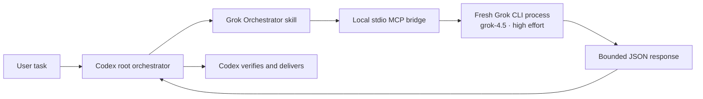

# Grok Orchestrator for Codex

[](https://github.com/keiranhaax/grok-plugin/tree/v0.1.0)
[](https://x.ai/)
[](LICENSE)

Use Grok 4.5 as a bounded advisor, web researcher, or read-only workspace
reviewer inside Codex. Codex remains the root orchestrator: it owns the plan,
decides what feedback to accept, implements changes, verifies the result, and
answers the user.

The plugin connects Codex to an already authenticated local Grok CLI. It does
not require an xAI API key in Codex and does not copy or expose Grok
credentials.

## Why use it?

- Challenge a complex plan with an independent model before implementation.
- Run a second web-research pass and compare sources.
- Ask Grok to inspect a workspace without granting write or shell tools.
- Double-check a material technical conclusion before delivery.
- Keep one orchestrator in charge instead of creating competing agent loops.

Grok is intentionally advisory. Its output is treated as untrusted input that
Codex must verify against repository evidence or primary sources.

## How it works



1. Codex identifies a useful consultation, research, or review gate.
2. Codex creates a self-contained packet with the task, constraints, relevant
   evidence, uncertainties, and expected output.
3. The local MCP bridge starts a fresh Grok process pinned to `grok-4.5` with
   `high` reasoning effort.
4. The selected role receives only its approved tools.
5. The bridge removes internal reasoning and session identifiers and returns a
   stable JSON envelope.
6. Codex checks the response, resolves conflicts, and keeps final control.

There is no second orchestrator and no Grok-to-Codex session handoff. Every
request is independent at the plugin interface.

## Tool modes

| Tool | Purpose | Grok tool access | Working directory |
| --- | --- | --- | --- |
| `consult_grok(packet)` | Plan critique, tradeoff analysis, second opinions, answer checks | None | Temporary empty directory |
| `research_with_grok(packet)` | Current or niche web research with source links | `web_search`, `web_fetch` | Temporary empty directory |
| `review_workspace_with_grok(packet, cwd)` | Read-only code, architecture, security, and test review | `read_file`, `grep`, `list_dir` | Canonical existing workspace |
| `grok_status()` | CLI, login, and exact model diagnostics | No model call | Not applicable |

The plugin does not expose an executor tool. Grok cannot edit files, run shell
commands, change Codex Goals, direct other workers, or deliver the final answer.

## Requirements

- Codex with plugin marketplace support
- Python 3.10 or newer; no third-party Python packages are required
- The Grok CLI available through one of:
  - `GROK_CLI_PATH`
  - the current `PATH`
  - `~/.local/bin/grok`
  - `~/.grok/bin/grok`
  - `/opt/homebrew/bin/grok`
  - `/usr/local/bin/grok`
- A Grok CLI login with the exact `grok-4.5` model available

Check the Grok CLI before installing:

```sh
grok --version
grok models
```

If needed, authenticate outside Codex:

```sh
grok login
```

## Installation

Add the GitHub repository as a Codex marketplace, then install the plugin:

```sh
codex plugin marketplace add keiranhaax/grok-plugin
codex plugin add grok-orchestrator@grok-plugin
```

Start a new Codex task after installation. Skills and MCP tools are loaded when
the task starts, so an existing task may not see the newly installed plugin.

Confirm the installation:

```sh
codex plugin list
```

The installed entry should include:

```text
grok-orchestrator@grok-plugin
```

## Usage

You normally do not call the MCP functions yourself. Ask Codex in natural
language and mention Grok explicitly when you require it.

### Check availability

```text
Use Grok Orchestrator to check whether Grok 4.5 is ready. Do not make a model call.
```

This uses `grok_status()` to inspect the binary, CLI version, login state, and
exact `grok-4.5` availability.

### Challenge a plan

```text
Ask Grok 4.5 to challenge this migration plan. Focus on unsafe sequencing,
rollback gaps, data-loss risks, and missing verification. Codex should decide
which feedback to accept.

<paste the complete plan and constraints>
```

This uses `consult_grok`. Grok receives the supplied packet and no tools.

### Get a second opinion

```text
Use Grok as an independent advisor. Compare these two architecture options,
identify the deciding tradeoffs, and recommend what evidence Codex should verify.

<include the options, constraints, and known evidence>
```

### Research a current topic

```text
Research this with Grok 4.5. Use primary sources where possible, include direct
links for factual claims, separate facts from inference, and report uncertainty.

Question: <your research question>
```

This uses `research_with_grok`. Grok receives only web search and fetch tools.
Codex must independently check important claims before presenting them as fact.

### Review a workspace

```text
Have Grok review /absolute/path/to/project for correctness regressions, security
issues, data-integrity risks, and missing tests. Require file paths and line
numbers. Do not edit anything.
```

This uses `review_workspace_with_grok`. The directory must already exist and is
resolved to a canonical path before Grok starts.

### Run a final material double-check

```text
Before delivering, ask Grok to independently check the following conclusion for
material errors. Then verify any disagreement yourself and return one resolved
answer, not two conflicting opinions.

<conclusion and supporting evidence>
```

## Recommended workflows

### Plan review gate

```text
Codex creates plan
    → Grok challenges gaps and risks
    → Codex accepts or rejects each material point
    → Codex implements and verifies
```

### Evidence-heavy research

```text
Codex frames the question
    → Grok performs a bounded web search
    → Codex opens and verifies primary sources
    → Codex resolves conflicts and synthesizes
```

### Risky workspace review

```text
Codex identifies review scope
    → Grok performs read-only inspection
    → Codex reproduces each important finding
    → Codex fixes and tests only when authorized
```

By default, the skill makes at most one proactive Grok call at a decision gate.
Multiple passes should be explicitly requested because they increase latency and
consume more Grok allowance.

## Writing a good packet

Grok calls are stateless, so the packet must contain everything needed to answer
the question. Include:

1. The exact question or decision.
2. Relevant facts, code excerpts, or the artifact being reviewed.
3. Constraints and non-goals.
4. Your current proposal or conclusion.
5. Known uncertainties and what would change the decision.
6. The expected output format, such as prioritized findings or source links.

Do not include credentials, private keys, tokens, `.env` contents, or unrelated
personal data.

## Response contract

Successful model calls return a JSON envelope like:

```json
{
  "ok": true,
  "mode": "consult",
  "text": "Grok's response text",
  "requested_model": "grok-4.5",
  "effort": "high",
  "stop_reason": "EndTurn"
}
```

Failures return a stable error shape:

```json
{
  "ok": false,
  "error": {
    "code": "grok_failed",
    "message": "Redacted diagnostic"
  },
  "requested_model": "grok-4.5",
  "effort": "high"
}
```

The bridge does not return Grok thoughts, credentials, or session identifiers.
Diagnostics redact prompt contents and common bearer-token, API-key, secret,
password, session-ID, and request-ID patterns.

## Security and privacy boundaries

Every model call uses:

- the exact `grok-4.5` model;
- `high` reasoning effort;
- the `strict` Grok OS sandbox;
- `dontAsk` permission mode;
- a mode-specific tool allowlist and denylist;
- `--no-memory` and no session resumption;
- no `--yolo` or bypass-permissions mode;
- no automatic CLI update;
- a mode-`0600` temporary prompt file deleted in a `finally` cleanup path;
- a 600-second Grok process timeout and 900-second Codex MCP tool timeout.

The workspace reviewer is read-only at the tool boundary, but file content that
Grok reads is sent to the Grok service for inference. Review the packet and
workspace scope before invoking it on proprietary or sensitive code.

The plugin is stateless at its interface. The Grok CLI may still maintain its
normal private cache or session files under `GROK_HOME` or `~/.grok`.

## Environment variables

| Variable | Purpose |
| --- | --- |
| `GROK_CLI_PATH` | Explicit path to the Grok executable; takes priority over `PATH` |
| `GROK_HOME` | Optional Grok data/configuration home honored by the Grok CLI |

The bridge also sets `NO_COLOR=1` and `RUST_LOG=error`. Research mode enables
Grok web fetch for that child process.

## Troubleshooting

### Grok CLI not found

```sh
command -v grok
grok --version
```

If Grok is installed somewhere non-standard, set `GROK_CLI_PATH` before
starting Codex.

### Login or model unavailable

```sh
grok login
grok models
```

The model list must advertise the exact `grok-4.5` ID. A different default
model is acceptable because every plugin call explicitly pins `grok-4.5`.

### Tools do not appear in Codex

1. Confirm the plugin is installed with `codex plugin list`.
2. Start a new Codex task.
3. Ask Codex to run `grok_status()`.

### Call timed out

The Grok process limit is 600 seconds. Narrow the packet or workspace scope and
retry. A failed proactive check is not approval; Codex should disclose the
failure and continue only when the Grok call was optional.

### Research returned weak sources

Ask for primary sources and direct links in the packet. Grok's source list is
still untrusted; Codex should open and verify material sources independently.

## Updating

Refresh the Git marketplace, reinstall the updated plugin snapshot, and start a
new task:

```sh
codex plugin marketplace upgrade grok-plugin
codex plugin add grok-orchestrator@grok-plugin
```

## Uninstalling

```sh
codex plugin remove grok-orchestrator@grok-plugin
codex plugin marketplace remove grok-plugin
```

Uninstalling the Codex plugin does not modify Grok configuration, credentials,
or private Grok cache/session files.

## Repository layout

```text
.agents/plugins/marketplace.json          Codex marketplace catalog
plugins/grok-orchestrator/
├── .codex-plugin/plugin.json             Plugin metadata
├── .mcp.json                             MCP launch configuration
├── scripts/grok_mcp.py                   Dependency-free stdio bridge
├── scripts/agent_profiles/               Bounded Grok role definitions
├── skills/grok-orchestrator/SKILL.md      Codex orchestration policy
└── tests/test_grok_mcp.py                Fake-CLI unit and protocol tests
```

## Development

Run the unit tests:

```sh
python3 -m unittest discover -s plugins/grok-orchestrator/tests -v
```

Validate the skill and plugin package:

```sh
python3 ~/.codex/skills/.system/skill-creator/scripts/quick_validate.py \
  plugins/grok-orchestrator/skills/grok-orchestrator

python3 ~/.codex/skills/.system/plugin-creator/scripts/validate_plugin.py \
  plugins/grok-orchestrator
```

The tests use a fake Grok executable. They verify binary resolution, exact
model and effort flags, role tool boundaries, strict sandboxing, prompt-file
permissions and cleanup, workspace validation, timeouts, malformed responses,
error redaction, and core MCP methods without consuming Grok allowance.

## Limitations

- Only `grok-4.5` with `high` effort is supported in v0.1.
- Grok is advisory and cannot implement changes.
- Calls do not share or resume a Grok session.
- Web and workspace claims are not automatically trusted or independently
  verified by the bridge.
- Availability checks do not make a model call and therefore do not prove a
  future request will complete successfully.

## Author and license

Created and maintained by [keiranhaax](https://github.com/keiranhaax).

Licensed under the [MIT License](LICENSE).
